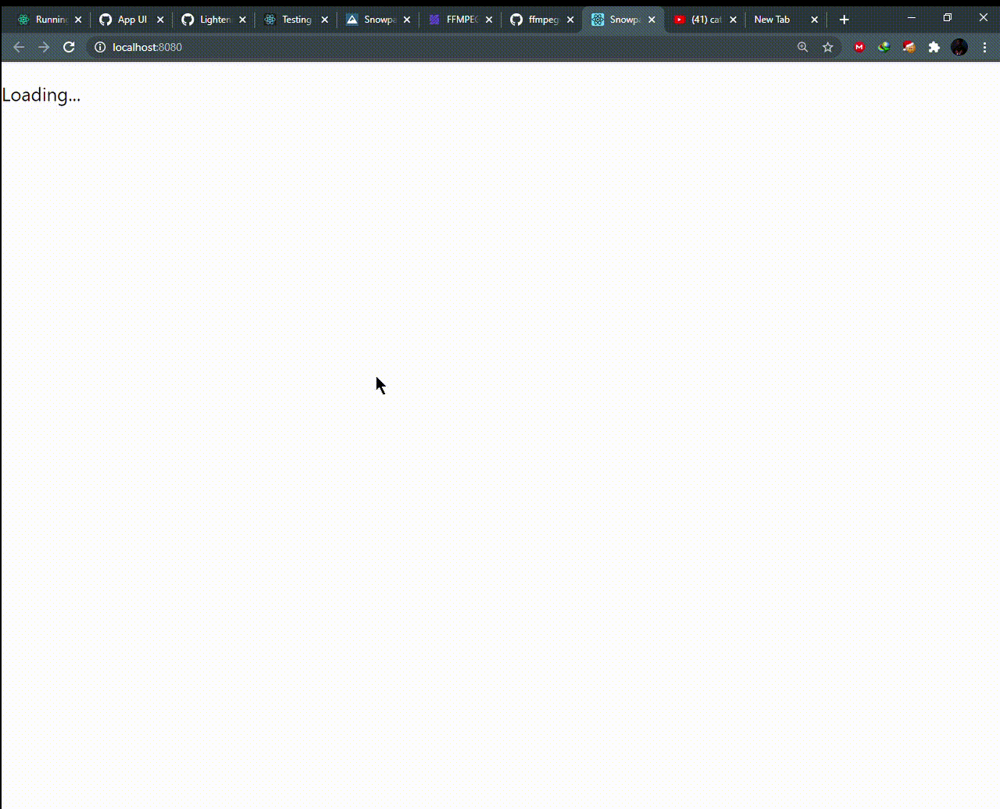
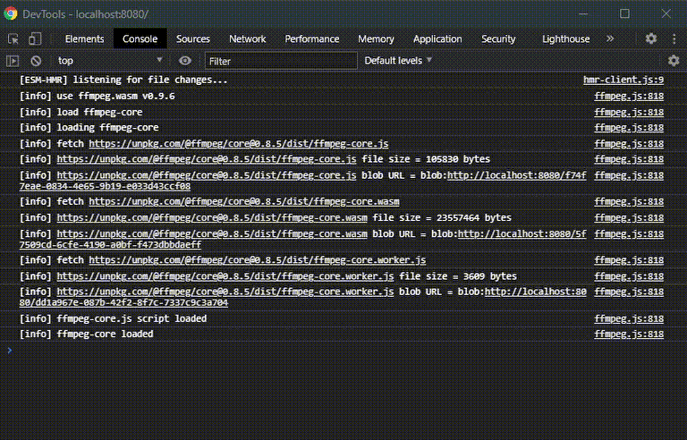

# New Project

> ✨ Bootstrapped with Create React App.

## Available Scripts

`npm install` - install the necessary dependencies

`npm start` -  starts the application

This is basically runnning in the browser and uses the underlying hardware to convert video files using FFmpeg.

<h6 style="color:red">Dont try to convert a file larger than 200mb your PC will surely blow up</h6>

Example images below (converted the gifs using this library, actually pretty dope)

and it also shows the logs if you set them when initializing FFmpeg. 
`const ffmpeg = createFFmpeg({ log: true })`
That shows you what is happening while the file is converting in DevTools 

Definately more experiments on Web Assembly!
