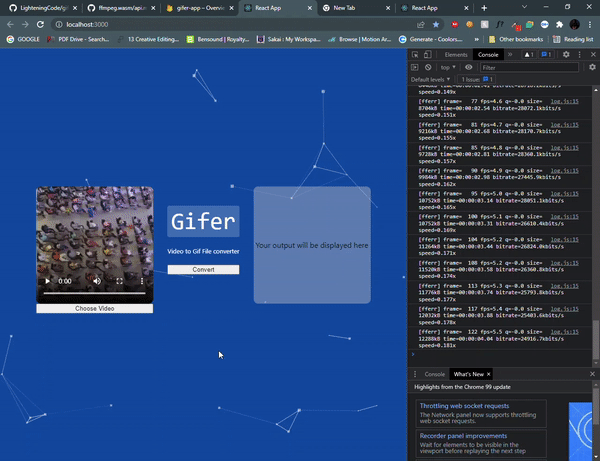

# New Project

> ✨ Bootstrapped with Create Snowpack App (CSA).

## Available Scripts
npm start -  starts the application

this is basically runnning in the browser and uses the underlying hardware to convert video files using FFmpeg.

Example images below (converted the pictures using this, actually pretty dope)

and it also shows the logs if you set them when initializing FFmpeg. That makes you get to see what is happening at in DevTools

Definately more experiments on Web Assembly!
